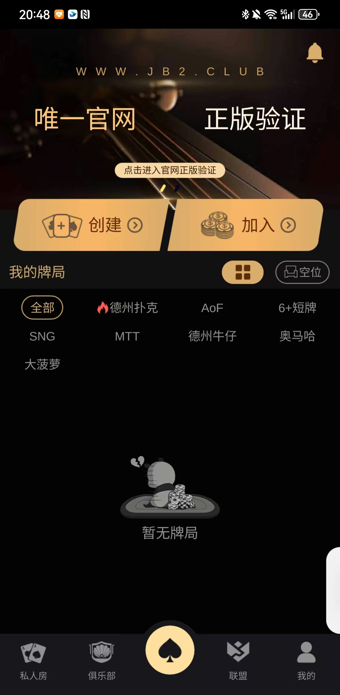
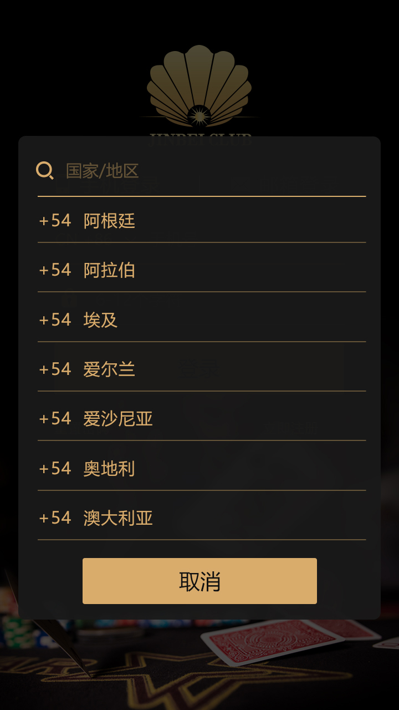
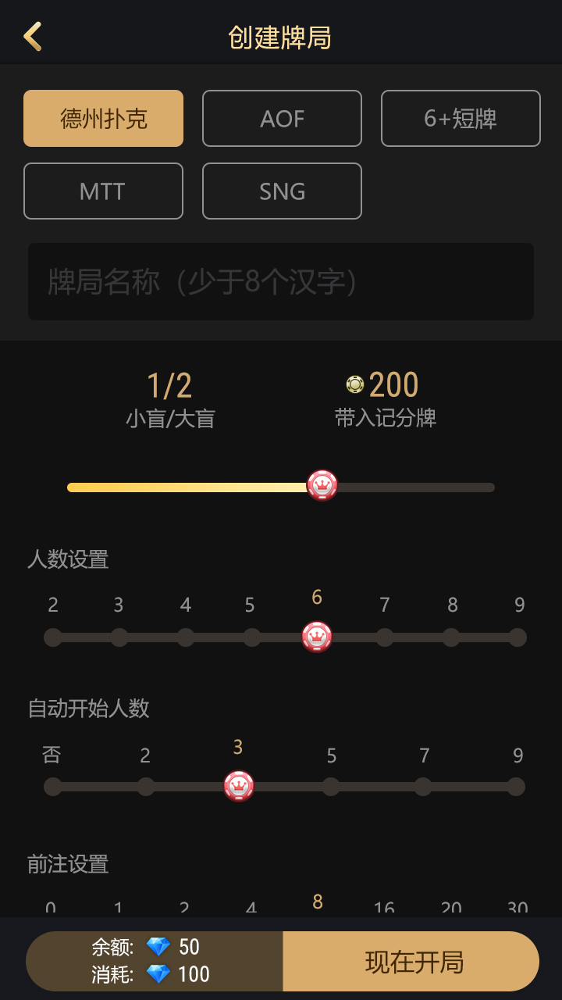
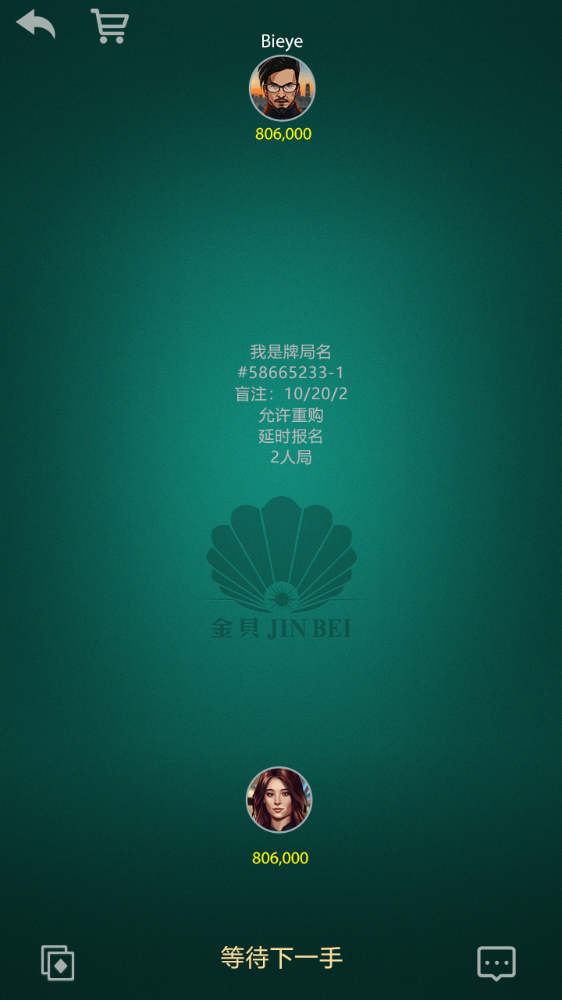
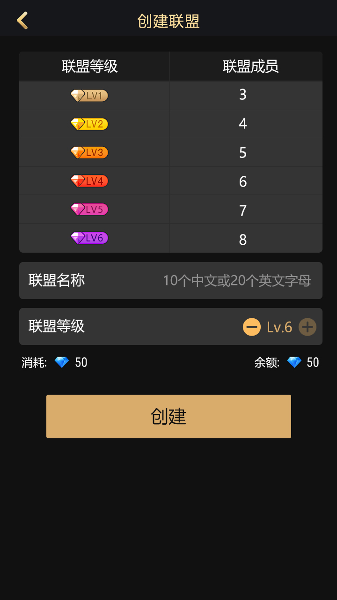
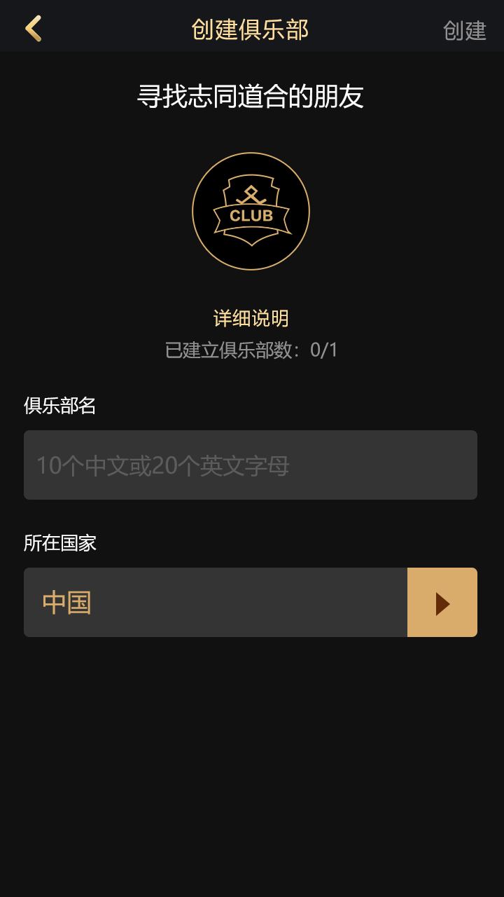
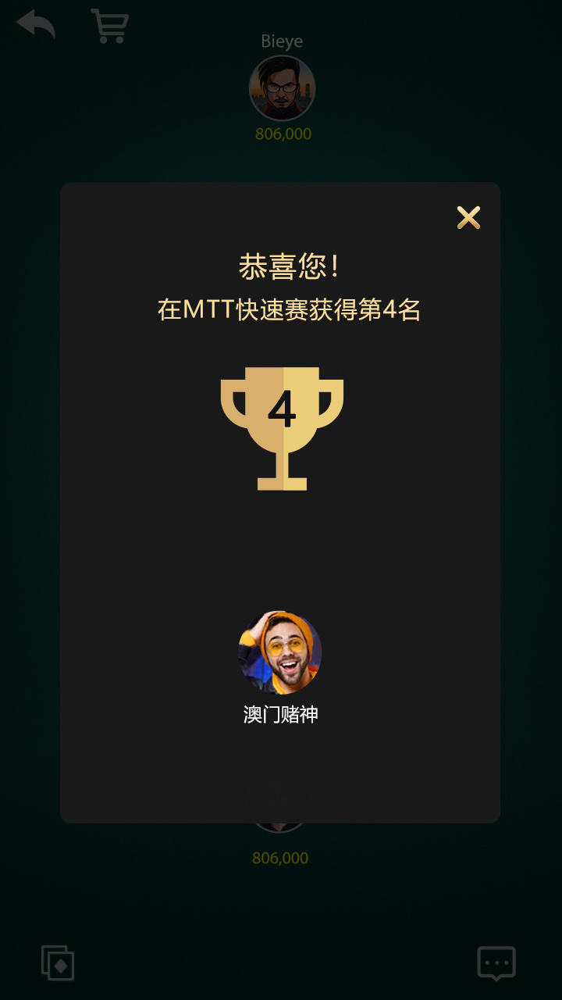
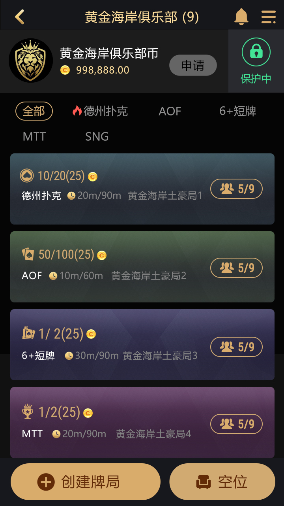

# 🃏 德州扑克源码 | 德州俱乐部源码 | 德州扑克服务器引擎
**德州源码 · 德州联盟源码 · 德州私人局 · 德州朋友局源码**  
实时多人**德州扑克**高并发服务器引擎（C++ + WebSocket），支持私人局/朋友局/俱乐部模式

**Texas Hold'em Multiplayer Poker Source Code** | **Real-time Multiplayer Poker Server Engine** | Scalable Game Backend

[](https://github.com/pokerdeveloper/dezhou-poker-source-code/stargazers)
[](https://github.com/pokerdeveloper/dezhou-poker-source-code/network/members)
[](https://opensource.org/licenses/MIT)

---
---

## ✨ 项目核心亮点

- **服务器权威架构**：所有游戏逻辑（发牌、牌型计算、动作验证、下注）均在服务端执行，有效防作弊、防外挂
- **高并发实时同步**：基于 WebSocket 的低延迟事件驱动架构，支持高并发多人对战
- **完整德州扑克支持**：经典德州（9人桌 / 6人桌）、私人局、朋友局、俱乐部房间模式
- **AI Bot 支持**：内置智能机器人，可用于测试或自动填充桌位
- **模块化设计**：网络层、游戏逻辑、数据库完全解耦，易于二次开发和扩展
- **技术栈**：现代 C++ + WebSocket + MySQL/Redis，性能优秀、结构清晰

> **⚠️ 重要声明**：本项目**仅供学习和研究使用**，严格禁止用于任何真实货币赌博活动。商业使用请自行遵守当地法律法规，作者不承担任何法律责任。

---
## 🛠 技术栈

- **主要语言**：C++（98.8%）
- **网络层**：WebSocket（支持二进制协议，低延迟）
- **架构**：Server-Authoritative（服务器权威） + Room-Based（房间隔离） + Event-Driven
- **存储**：MySQL / Redis（推荐用于缓存和分布式）
- **其他**：多线程安全、日志系统、Shell 脚本辅助

客户端不绑定具体框架，可搭配 Unity、Web、React 等任意前端，只需实现 WebSocket 协议即可接入
---

## 🚀 快速开始
### 方式一：使用 Docker（推荐，无需编译）
**```bash**
# 1. 克隆本仓库（注意：地址正确）
git clone https://github.com/pokerdeveloper/dezhou-poker-source-code.git
cd dezhou-poker-source-code

# 2. 使用 docker-compose 一键启动（需先安装 docker-compose）
docker-compose up -d

# 3. 测试 WebSocket 连接
# 使用浏览器或 wscat 工具：wscat -c ws://localhost:8080
# 发送测试消息：{"type":"ping"}
方式二：从源码编译（适合二次开发）
环境要求：

Linux (Ubuntu 22.04+) 或 macOS

CMake 3.15+

C++17 编译器 (GCC 9+ 或 Clang 10+)

MySQL 8.0+ / Redis 6.0+
编译步骤：
# 1. 安装依赖（Ubuntu）
sudo apt update
sudo apt install -y cmake build-essential libssl-dev libmysqlclient-dev redis-server

# 2. 克隆并编译
git clone https://github.com/pokerdeveloper/dezhou-poker-source-code.git
cd dezhou-poker-source-code
mkdir build && cd build
cmake .. -DCMAKE_BUILD_TYPE=Release
make -j$(nproc)

# 3. 配置并运行
cp ../config/demo.json ./config/
./poker_server --config ./config/demo.json
## 📞 联系与合作

Telegram：@alibabama401


Email：ttpoker733@gmail.com

欢迎讨论技术实现、部署问题、功能定制或合作开发等专业话题。

## 📸 项目截图
**德州扑克游戏大厅**




**登录界面**




**创建牌局**



**MTT打牌房间**



**创建联盟**












## 📈 未来路线图（Roadmap）

支持更多扑克变体（奥马哈、短牌进阶、Pineapple 等）
增加 SNG、MTT 锦标赛模式和联盟系统
完善分布式部署（Kubernetes + Redis 集群）
提供 Unity / Web 示例客户端代码
增强反作弊模块（行为分析、设备指纹等）
多语言支持与国际化

欢迎社区通过 Issue 和 Pull Request 共同完善！


## ⭐ 支持项目
如果你觉得这个项目对你有帮助，欢迎 Star 支持一下！


再次声明：本仓库为开源学习项目，不包含任何支付或真实赌博功能。请遵守当地法律法规，合理使用。
关键词：德州扑克源码、德州源码、德州俱乐部源码、德州联盟源码、德州私人局源码、德州朋友局源码、Texas Hold'em source code、poker server、multiplayer poker、C++ poker game engine、websocket poker


📝 更新日志
2026-04-27：修复 README 中的 git clone 地址，优化快速开始指南

2026-01-01：初始版本发布

